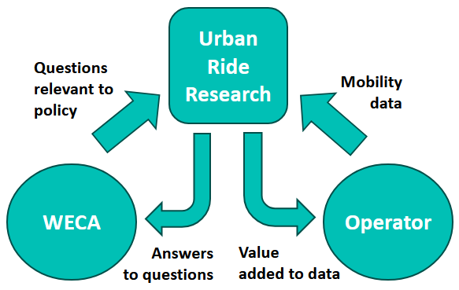

# About the project

The project aims to enable the sharing of micromobility data for research and policy support.
{.banner}

This data is routinely collected by GPS sensors on e-scooters and e-bikes across the region. It includes information on actual routes travelled, speed, date and time, and rider demographics.

We’re working to make the full dataset available for researchers at University of Bristol and UWE. We hope that the data will be used to inform wider transport planning and measure social inclusion.

We’re looking for **pathfinder project ideas** that could use the data to inform **transport planning** and measure **social inclusion** across the city, or would otherwise be of public benefit.

## Example research topics

Possible research topics include:

### Safety and comfort​

* Safety
* Comfort

### Transport policy

* Access and usage​
* Modal shift​
* Employment and economy​
* Transport integration​
* Network performance​

## Management and operational

* Parking & highways​
* Redeployment​
* Communication & education​
* Commercial models​

### Wider impacts

* Health & wellbeing​
* Carbon emissions​

## How the data will be shared

There will be processes to protect unauthorised use of data, and the data will be hosted in a Trusted Research Environment (TRE)​.
